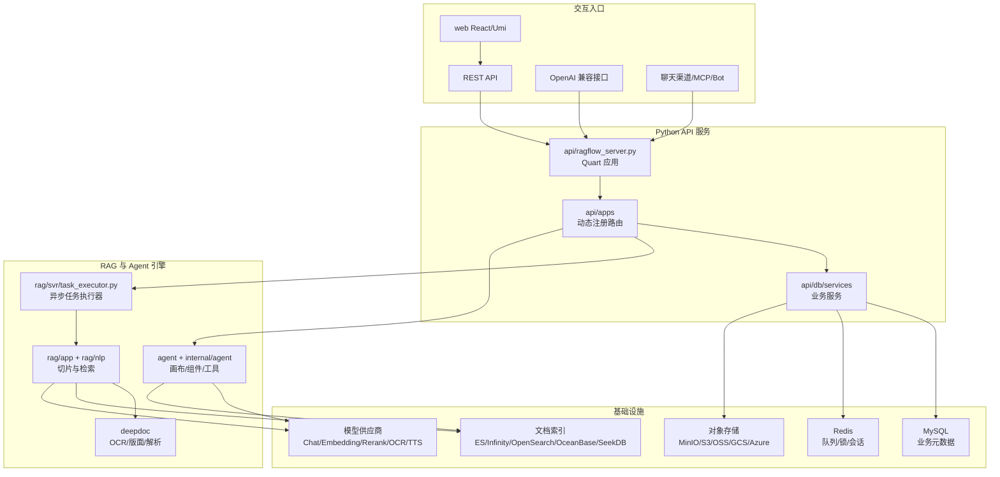
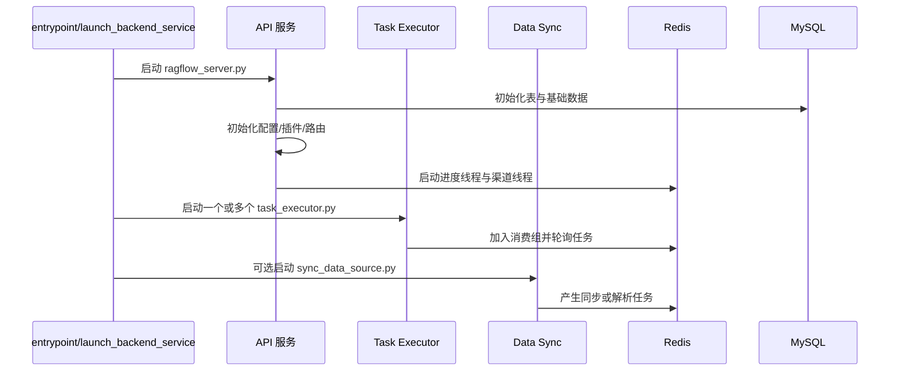
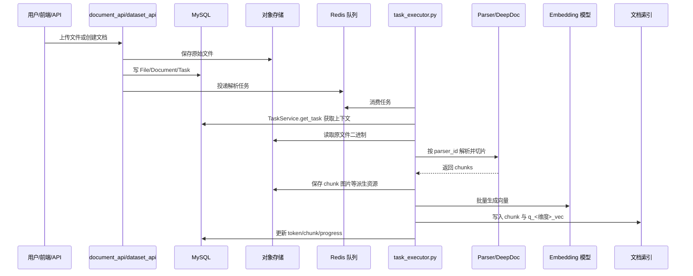
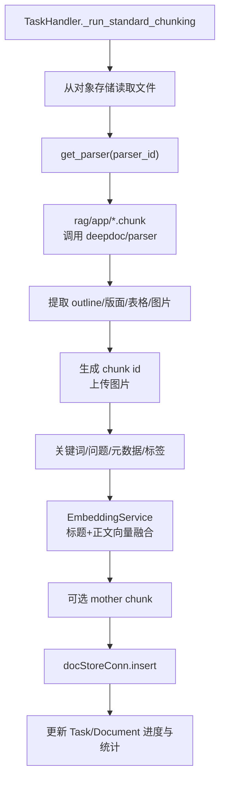
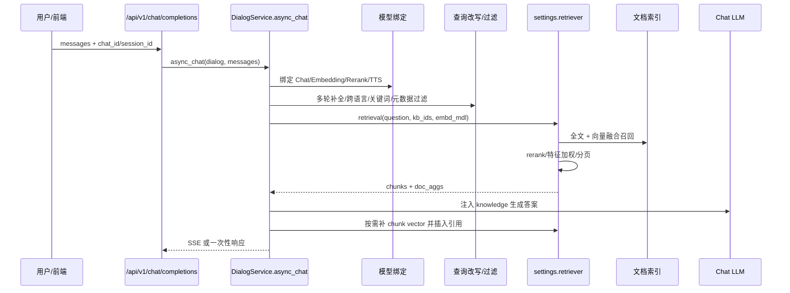
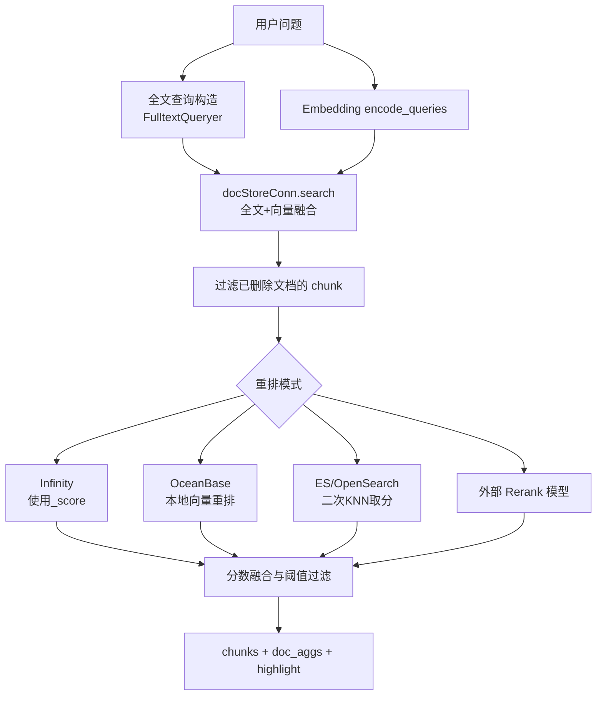
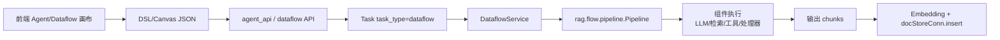

# RAGFlow 仓库核心逻辑梳理

本文面向需要快速理解或接手 RAGFlow 代码的开发者，基于当前仓库源码梳理核心模块、启动路径、文档入库链路、检索问答链路、Agent/Dataflow 扩展与外部依赖。

## 1. 总体定位

RAGFlow 是一个端到端 RAG 与 Agent 平台。核心能力可以拆成四层：

- 交互层：`web/` 前端、REST API、OpenAI 兼容 API、Bot/Channel/MCP 等入口。
- 业务层：`api/apps/` 路由与 `api/db/services/` 服务，负责租户、模型、知识库、文件、文档、会话、Agent、Connector 等业务对象。
- RAG 引擎层：`rag/` 与 `deepdoc/`，负责文档解析、切片、Embedding、索引、检索、重排、引用、GraphRAG/RAPTOR 等。
- 基础设施层：MySQL、Redis、MinIO/S3/OSS/GCS/Azure Blob、Elasticsearch/Infinity/OpenSearch/OceanBase/SeekDB，以及可选 Sandbox、MCP、Admin 服务。



## 2. 代码目录地图

| 目录 | 核心职责 |
| --- | --- |
| `api/` | Python 后端 API。`ragflow_server.py` 是主入口，`apps/` 是路由，`db/` 是 Peewee 模型与服务层。 |
| `rag/` | RAG 核心。`app/` 是不同解析/切片模板，`nlp/search.py` 是混合检索与重排，`svr/` 是任务执行与数据源同步。 |
| `deepdoc/` | 深度文档理解。PDF/OCR/版面分析、表格、图片、Office/HTML/Markdown/TXT 等解析器。 |
| `agent/` | Python Agent 画布组件、工具、插件、模板与沙箱客户端。 |
| `internal/` | Go 方向的新服务化实现或补充实现，包含 Agent Canvas、工具、服务、路由、存储等模块。Docker 启动可通过 `API_PROXY_SCHEME` 切到 Go/Hybrid。 |
| `common/` | 跨模块基础能力：配置、存储、文档引擎连接、队列、日志、工具函数。 |
| `web/` | React + TypeScript + Umi 前端。页面按 dataset/chat/agent/files/admin 等业务域组织。 |
| `docker/` | Compose、Nginx、entrypoint、依赖服务配置。 |
| `sdk/`、`mcp/`、`admin/` | SDK、MCP Server、Admin 服务。 |

## 3. 启动与进程模型

开发环境常用入口是 `docker/launch_backend_service.sh`，容器入口是 `docker/entrypoint.sh`。

主要进程：

- API 服务：`api/ragflow_server.py`
  - 初始化日志、配置、数据库表与初始数据。
  - 调用 `settings.init_settings()`，建立文档引擎连接、对象存储、Retriever。
  - 加载插件 `GlobalPluginManager.load_plugins()`。
  - 启动文档进度更新线程与聊天渠道线程。
  - 运行 Quart HTTP 服务。
- 任务执行器：`rag/svr/task_executor.py`
  - 通过 Redis Stream/队列消费文档处理任务。
  - 默认走重构后的 `TaskManager.run_refactored_task()`。
  - 负责解析、切片、Embedding、写入文档索引、更新文档进度。
- 数据源同步：`rag/svr/sync_data_source.py`
  - 负责 Notion、Google Drive、S3、Confluence、Slack、Jira 等外部数据源增量同步。
- 可选服务：Admin、MCP、Sandbox、Go API/Admin。



## 4. API 路由与业务服务

`api/apps/__init__.py` 动态扫描 `api/apps/*_app.py`、`api/apps/restful_apis/*.py`、`api/apps/sdk/*.py`，为每个文件创建 Blueprint 并注册：

- `restful_apis` 下路由统一挂到 `/api/v1`。
- 旧版兼容路由由 `api/apps/backward_compat.py` 额外注册。
- 认证入口是 `login_required`，支持 JWT、API Token、Beta Token，也支持 OAuth/OIDC 登录后的 session fallback。

主要 REST 模块：

| 文件 | 业务域 |
| --- | --- |
| `dataset_api.py` | 数据集/知识库创建、配置、索引、标签、GraphRAG/RAPTOR 管理。 |
| `document_api.py` | 文档上传、创建、解析、停止、元数据、缩略图、预览。 |
| `chunk_api.py` | Chunk 查询、增删改、检索测试。 |
| `chat_api.py` | Chat、Session、消息、语音、通用 `/chat/completions`。 |
| `agent_api.py` | Agent 画布、版本、调试、运行、Webhook、附件。 |
| `bot_api.py`、`openai_api.py` | Bot 分享/嵌入与 OpenAI 兼容接口。 |
| `provider_api.py`、`models_api.py`、`llm_app.py` | 模型供应商、模型实例、默认模型配置。 |
| `connector_api.py` | 外部数据源连接器与 OAuth。 |
| `memory_api.py`、`mcp_api.py`、`search_api.py` | 记忆、MCP Server、Search App。 |

业务数据模型集中在 `api/db/db_models.py`。关键表包括：

- 账号与租户：`User`、`Tenant`、`UserTenant`、`APIToken`。
- 模型：`LLMFactories`、`LLM`、`TenantLLM`、`TenantModelProvider`、`TenantModelInstance`、`TenantModel`。
- 知识库与文档：`Knowledgebase`、`Document`、`File`、`File2Document`、`Task`、`PipelineOperationLog`。
- 对话与应用：`Dialog`、`Conversation`、`Search`、`UserCanvas`、`CanvasTemplate`、`MCPServer`。
- 数据源与记忆：`Connector`、`Connector2Kb`、`SyncLogs`、`Memory`。

## 5. 配置、存储与检索引擎初始化

`common/settings.py` 是运行时全局配置中心：

- 从 `conf/service_conf.yaml` 和环境变量读取 DB、Redis、模型、存储、文档引擎配置。
- 根据 `DOC_ENGINE` 初始化 `docStoreConn`：
  - `elasticsearch` -> `rag.utils.es_conn.ESConnection`
  - `infinity` -> `rag.utils.infinity_conn.InfinityConnection`
  - `opensearch` -> `rag.utils.opensearch_conn.OSConnection`
  - `oceanbase` / `seekdb` -> `rag.utils.ob_conn.OBConnection`
- 根据 `STORAGE_IMPL` 初始化对象存储：MinIO、S3、OSS、GCS、Azure、OpenDAL。
- 创建 `settings.retriever = rag.nlp.search.Dealer(docStoreConn)`。
- 创建 `settings.kg_retriever = rag.graphrag.search.KGSearch(docStoreConn)`。

文档索引命名规则在 `rag/nlp/search.py`：

```python
def index_name(uid):
    return f"ragflow_{uid}"
```

即每个租户对应一个索引名前缀，知识库 ID 作为 doc store 的分区/集合维度参与查询。

## 6. 文档入库主流程

文档入库由 API 创建文档与任务，再由 Task Executor 异步处理。核心类是：

- `api/db/services/document_service.py::DocumentService`
- `api/db/services/task_service.py::TaskService`
- `rag/svr/task_executor.py`
- `rag/svr/task_executor_refactor/task_manager.py::TaskManager`
- `rag/svr/task_executor_refactor/task_handler.py::TaskHandler`
- `rag/svr/task_executor_refactor/chunk_service.py::ChunkService`
- `rag/svr/task_executor_refactor/embedding_service.py::EmbeddingService`



### 6.1 任务消费

`rag/svr/task_executor.py::collect()` 从 `settings.get_svr_queue_names()` 返回的高低优先级队列消费消息，使用 `SVR_CONSUMER_GROUP_NAME` 和 consumer name 做 Redis 消费组处理。拿到消息后：

1. 普通解析任务通过 `TaskService.get_task(task_id)` 补齐文档、知识库、租户、模型配置。
2. `dataflow`、`memory`、`graphrag`、`raptor` 等特殊任务补充对应上下文。
3. `handle_task()` 默认调用 `TaskManager.run_refactored_task()`，也保留原实现与 dry-run 对比模式。

### 6.2 TaskHandler 分派

`TaskHandler.handle()` 先绑定 Embedding 模型并初始化知识库索引，然后按任务类型分派：

| task_type | 处理路径 |
| --- | --- |
| `memory` | `handle_save_to_memory_task()` 写入记忆。 |
| `dataflow*` | `DataflowService.run_dataflow()` 执行画布/管道 DSL。 |
| `raptor` | `RaptorService.run_raptor_for_kb()` 生成层次摘要 chunk。 |
| `graphrag` | `run_graphrag_for_kb()` 构建知识图谱相关索引。 |
| `evaluation`、`reembedding`、`clone` | 预留或占位路径。 |
| 其他 | 标准文档解析切片 `_run_standard_chunking()`。 |

### 6.3 标准解析切片

标准流程在 `_run_standard_chunking()`：

1. 通过 `File2DocumentService.get_storage_address()` 定位对象存储地址。
2. 读取文件二进制。
3. `ChunkService.build_chunks()` 构建 chunk。
4. `EmbeddingService.embed_chunks()` 生成向量。
5. 可选生成 TOC chunk。
6. `ChunkService.insert_chunks()` 写入文档引擎。
7. `PostProcessor` 处理表格元数据和 TOC 插入。
8. `DocumentService.increment_chunk_num()` 更新文档统计。

`ChunkService.build_chunks()` 又分为：

- 文件大小检查。
- `chunk_builder.get_parser(parser_id)` 选择解析模板。
- `chunk_builder.run_chunking()` 在线程池中执行具体 `rag/app/*.py::chunk()`。
- 提取 PDF outline 并写入文档元数据。
- 上传 chunk 图片到对象存储。
- 可选自动关键词、问题、元数据、标签。



### 6.4 解析器体系

解析模板在 `rag/app/`：

- `naive.py`：通用模板，支持 PDF、DOCX、Excel、HTML、Markdown、TXT 等，通过 DeepDoc、Plain Text、MinerU、Docling、PaddleOCR、OpenDataLoader、TCADP 等路径解析。
- `paper.py`：论文 PDF 模板，强化标题、作者、摘要、章节与表格处理。
- `manual.py`、`book.py`、`presentation.py`、`table.py`、`qa.py`、`resume.py`、`picture.py`、`audio.py`、`email.py`、`tag.py`：面向不同内容类型的切片策略。

DeepDoc 在 `deepdoc/`：

- `deepdoc/parser/`：各文件类型解析器。
- `deepdoc/vision/`：OCR、版面识别、表格结构识别、后处理。

## 7. 检索与问答主流程

问答主入口之一是 `api/apps/restful_apis/chat_api.py::session_completion()`，核心生成逻辑在 `api/db/services/dialog_service.py::async_chat()`。



### 7.1 DialogService 生成链路

`async_chat()` 的关键步骤：

1. 如果没有知识库且未启用 web search，走 `async_chat_solo()`，直接调用模型。
2. 绑定模型：Chat、Embedding、Rerank、TTS。
3. 处理附件、Prompt 参数、引用元数据、SQL 检索候选。
4. 可选多轮问题改写 `full_question()`、跨语言改写、元数据过滤、关键词抽取。
5. 如果 Prompt 参数包含 `knowledge`：
   - 普通 RAG：调用 `settings.retriever.retrieval()`。
   - Reasoning/Deep Research：以 retriever 作为工具做研究式检索。
   - Web Search：调用 Tavily 补充外部结果。
   - KG：调用 `settings.kg_retriever.retrieval()`。
   - TOC 增强：调用 `retrieval_by_toc()`。
6. 用 `kb_prompt()` 将 chunk 压缩成知识上下文。
7. 把 `{knowledge}` 注入系统 Prompt，调用 Chat LLM。
8. 如果开启引用，调用 `insert_citations()` 或解析模型返回的引用标记，输出 answer/reference/prompt。

### 7.2 混合检索与重排

核心类是 `rag/nlp/search.py::Dealer`。

`Dealer.search()`：

- 用 `query.FulltextQueryer.question()` 构造全文匹配表达式。
- 如果有 Embedding 模型，调用 `emb_mdl.encode_queries()` 得到查询向量。
- 构造 `MatchDenseExpr(q_<维度>_vec, ...)`。
- 使用 `FusionExpr("weighted_sum", ...)` 组合全文和向量召回。
- 返回 ids、字段、highlight、aggregation、keywords。

`Dealer.retrieval()`：

- 根据 page/page_size/top 计算候选窗口。
- 调用 `search()` 获取候选。
- 过滤父文档已删除的 stale chunk。
- 根据引擎选择排序策略：
  - Infinity：使用引擎融合后的 `_score`。
  - OceanBase：取回 chunk 向量，本地 `rerank()`。
  - Elasticsearch/OpenSearch：第二次 KNN 查询取干净向量分数，再 `rerank_with_knn()`。
  - 配置 Rerank 模型时：`rerank_by_model()`。
- 合并 token similarity、vector similarity、标签特征、PageRank。
- 按阈值过滤，输出分页 chunks 和 doc_aggs。



## 8. Dataflow、Agent 与工具体系

RAGFlow 的 Agent 能力有两套相关实现：

- Python 侧 `agent/`：
  - `agent/canvas.py` 与 `agent/component/*` 实现画布组件。
  - `agent/tools/*` 提供检索、搜索、代码执行、金融、学术、邮件、SQL 等工具。
  - `agent/templates/*.json` 提供内置模板。
  - `agent/plugin/` 支持工具插件加载。
- Go 侧 `internal/agent/`：
  - `canvas/` 实现调度器、状态、Checkpoint、循环、并行、取消/恢复。
  - `component/` 实现 Begin、LLM、Message、Retrieval、Switch、Data Operations、Code Exec 等组件。
  - `tool/` 实现工具注册与外部工具。
  - `sandbox/` 支持多种代码执行沙箱 provider。

Dataflow 任务由 `rag/svr/task_executor_refactor/dataflow_service.py` 执行：

- 从 `UserCanvasService` 加载 DSL。
- 构造 `rag.flow.pipeline.Pipeline`。
- 执行 pipeline 产出 chunks。
- 对输出做 Embedding、元数据处理和索引写入。



## 9. 前端如何连接后端

`web/` 是 React + TypeScript + UmiJS 应用：

- 路由定义：`web/src/routes.tsx`。
- 请求封装：`web/src/utils/request.ts`、`web/src/utils/api.ts`、`web/src/services/*`。
- 主要页面：
  - `pages/datasets`、`pages/dataset`：知识库列表、文档管理、解析状态、知识图谱、检索测试、配置。
  - `pages/chat` 或相关 Chat 模块：对话应用与会话。
  - `pages/agent`、`pages/agents`：Agent 画布、模板、运行、调试、日志、Webhook。
  - `pages/files`：文件管理与知识库关联。
  - `pages/admin`：Admin 后台。

前端大体不直接接触 RAG 算法，而是通过 service 调后端 API；解析进度、会话流式输出、Agent 日志等由接口轮询或 SSE 流驱动。

## 10. 外部依赖与部署拓扑

`docker/docker-compose-base.yml` 定义基础依赖：

- MySQL：业务元数据。
- Redis：任务队列、锁、会话、缓存。
- MinIO：默认对象存储。
- Elasticsearch/OpenSearch/Infinity/OceanBase/SeekDB：文档全文与向量索引，按 profile 选择。
- Sandbox Executor Manager：可选代码执行沙箱。

`docker/docker-compose.yml` 定义 RAGFlow 服务容器：

- `ragflow-cpu`、`ragflow-gpu` 通过同一个镜像启动。
- 容器内 `entrypoint.sh` 负责生成 `service_conf.yaml`、选择 Nginx 代理模式、启动 API、Task Executor、Data Sync、Admin、MCP 等。
- 端口包括 Web/Nginx、Python API、Admin、MCP、Go API/Admin。

## 11. 关键扩展点

| 目标 | 建议入口 |
| --- | --- |
| 新增文件解析/切片策略 | 在 `rag/app/` 增加或扩展 `chunk()`，并在 `chunk_builder.get_parser()` 注册 parser_id。 |
| 新增文档解析后处理 | 扩展 `chunk_post_processor.py` 或 `PostProcessor`。 |
| 新增检索排序特征 | 扩展 `Dealer.retrieval()`、`rerank_*()` 或 rank_feature 构造逻辑。 |
| 新增模型供应商 | 扩展 `rag/llm/`、模型元数据配置与 `provider_api` 相关服务。 |
| 新增外部数据源 | 扩展 `common/data_source/` 与 `rag/svr/sync_data_source.py` 的 connector 映射。 |
| 新增 Agent 工具 | Python 侧扩展 `agent/tools/` 与插件注册；Go 侧扩展 `internal/agent/tool/registry.go`。 |
| 新增前端页面/API | 前端 `web/src/pages` + `web/src/services`，后端 `api/apps/restful_apis` + `api/db/services`。 |

## 12. 阅读代码建议

如果要顺着一条链路读源码，可以按下面顺序：

1. 启动与全局配置：`api/ragflow_server.py` -> `api/apps/__init__.py` -> `common/settings.py`。
2. 文档入库：`document_api.py` -> `DocumentService/TaskService` -> `rag/svr/task_executor.py` -> `TaskManager` -> `TaskHandler` -> `ChunkService` -> `EmbeddingService`。
3. 解析模板：`rag/app/naive.py`、目标 parser 文件、`deepdoc/parser`、`deepdoc/vision`。
4. 检索问答：`chat_api.py::session_completion` -> `dialog_service.py::async_chat` -> `rag/nlp/search.py::Dealer`。
5. Agent/Dataflow：`agent_api.py` -> `agent/` 或 `internal/agent/` -> `DataflowService` -> `rag.flow.pipeline`。

