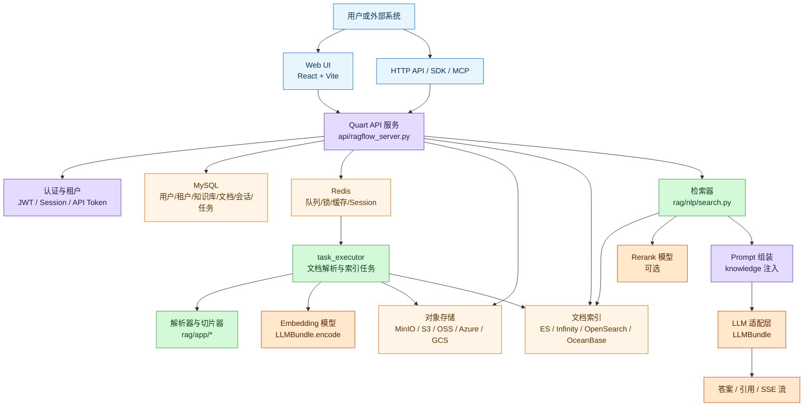
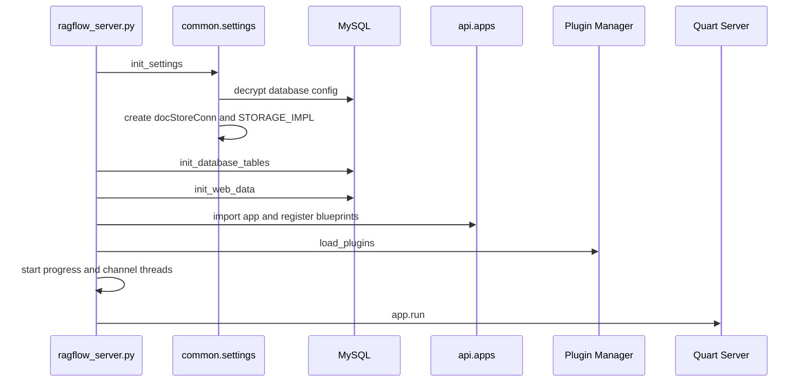
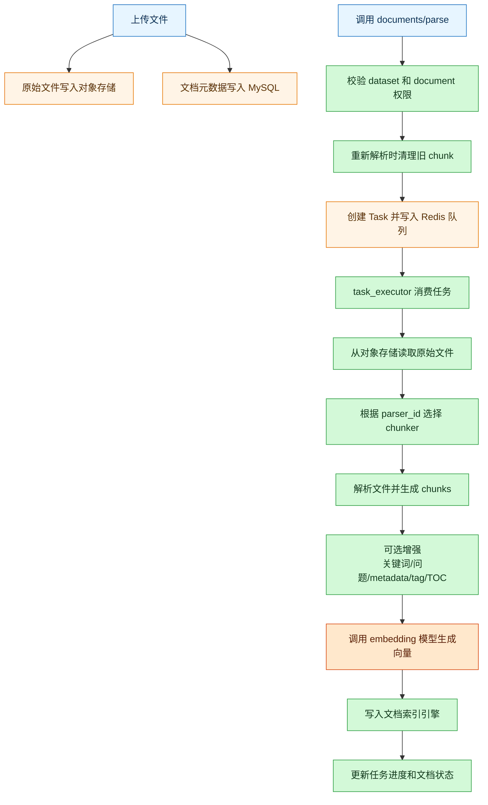
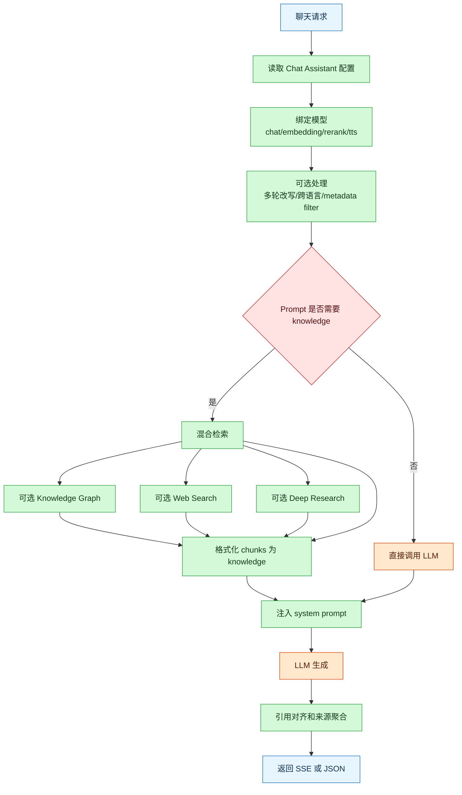
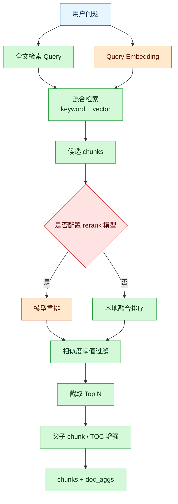
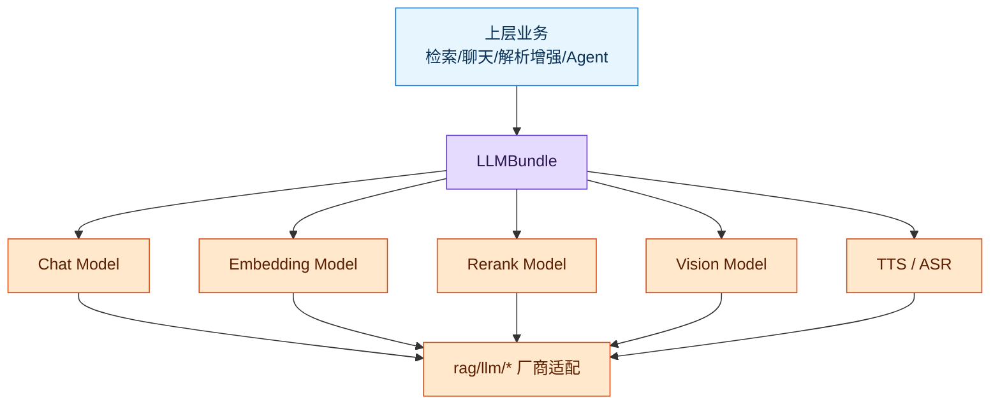
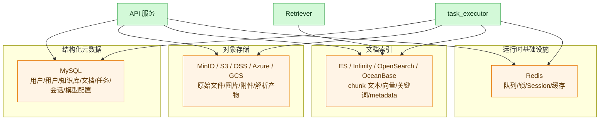
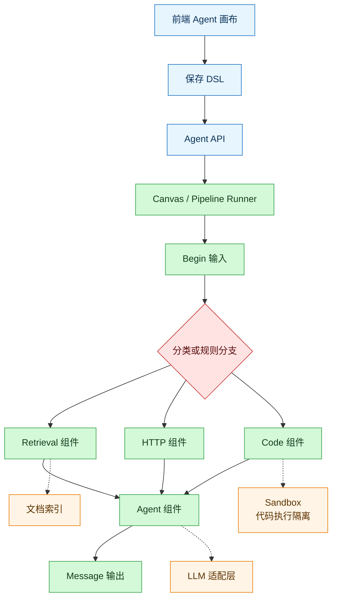
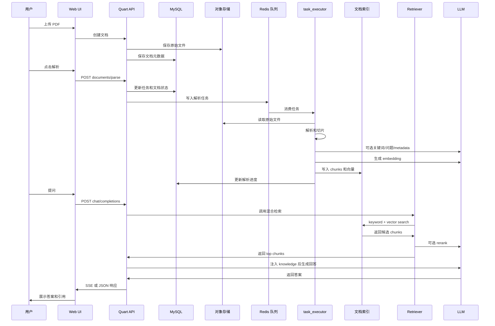

# RAGFlow 实现方式导览

本文面向希望理解或二次开发 RAGFlow 的开发者，按系统执行链路梳理 RAGFlow 如何把文件、知识库、检索、模型调用和 Agent 工作流串起来。

一句话概括：RAGFlow 是一个完整的 RAG 工程系统。它通过异步任务把复杂文档解析成带版面、图片、metadata、向量和关键词的 chunk，再用可插拔搜索引擎做全文加向量混合检索，最后把检索结果注入 prompt，由统一模型适配层调用 LLM 生成带引用的答案。

## 整体架构

RAGFlow 的主链路可以理解为：

```text
Web UI / HTTP API
  -> Quart API 服务
  -> MySQL 元数据
  -> Redis 任务队列
  -> task_executor 文档处理
  -> 对象存储与文档索引
  -> 混合检索与重排
  -> LLM 生成回答
```



## 关键模块职责

| 模块 | 目录或文件 | 职责 |
| --- | --- | --- |
| API 服务入口 | `api/ragflow_server.py` | 初始化配置、数据库、插件、后台线程，并启动 Quart 服务 |
| API 注册与认证 | `api/apps/__init__.py` | 动态注册 Blueprint，处理 JWT、Session、API Token 认证 |
| REST API | `api/apps/restful_apis/` | 知识库、文档、聊天、Agent、模型、文件等 API |
| 元数据服务 | `api/db/services/` | 封装用户、知识库、文档、会话、任务、模型配置等数据库操作 |
| 全局设置 | `common/settings.py` | 初始化 doc store、对象存储、默认模型、检索器等 |
| 文档任务执行 | `rag/svr/task_executor.py` | 消费 Redis 任务，执行解析、切片、embedding、索引写入 |
| 解析模板 | `rag/app/` | 不同文档类型和切片模板，如 general、paper、table、qa、resume |
| 检索器 | `rag/nlp/search.py` | 全文检索、向量检索、融合排序、rerank、引用对齐 |
| 模型适配 | `api/db/services/llm_service.py`、`rag/llm/` | 统一封装 chat、embedding、rerank、vision、tts 等模型能力 |
| Agent 工作流 | `agent/`、`api/apps/restful_apis/agent_api.py` | 画布 DSL、组件编排、Agent 对话、工具调用、Webhook |
| 前端 | `web/` | React + Vite Web UI，提供知识库、聊天、Agent、设置等页面 |

## 服务启动与 API 注册

后端入口是 `api/ragflow_server.py`。启动时会执行：

1. 初始化日志和配置。
2. 调用 `settings.init_settings()` 初始化底层连接。
3. 初始化数据库表和内置数据。
4. 初始化运行时配置。
5. 加载插件。
6. 启动文档进度更新线程和聊天渠道线程。
7. 启动 Quart HTTP 服务。

API 应用本体在 `api/apps/__init__.py`。这里的特点是动态注册：它扫描 `api/apps/*_app.py`、`api/apps/restful_apis/*.py`、`api/apps/sdk/*.py`，为每个模块创建 Blueprint 并注册 URL 前缀。新 REST API 通常挂在 `/api/v1/...`，老 API 通过 `api/apps/backward_compat.py` 保持兼容。



## 文档入库与索引流程

文档入库是异步的。API 只负责校验、落库、创建任务；真正消耗 CPU、模型和索引资源的工作由 `task_executor` 完成。

触发解析的 REST 接口是：

```text
POST /api/v1/datasets/{dataset_id}/documents/parse
```

对应代码在 `api/apps/restful_apis/document_api.py` 的 `parse_documents()`。

核心流程：

1. 校验用户是否可以访问 dataset。
2. 校验 document 是否属于该 dataset。
3. 如果是重新解析，删除旧 chunk 和旧索引。
4. 更新文档状态为 running。
5. 调用 `DocumentService.run(...)` 创建任务。
6. 任务进入 Redis 队列。
7. `rag/svr/task_executor.py` 消费任务。
8. 从对象存储读取原始文件。
9. 根据 `parser_id` 选择 `rag/app/*` 中的 chunker。
10. 生成 chunk、图片、关键词、问题、metadata、tag。
11. 调用 embedding 模型生成向量。
12. 写入 doc store。
13. 更新任务和文档进度。



## 解析器与 chunk 结构

`task_executor.py` 中的 `FACTORY` 把不同 `parser_id` 映射到不同解析模块：

| parser_id | 模块 | 典型用途 |
| --- | --- | --- |
| `naive` / `general` | `rag/app/naive.py` | 通用文档 |
| `paper` | `rag/app/paper.py` | 论文 |
| `book` | `rag/app/book.py` | 书籍 |
| `presentation` | `rag/app/presentation.py` | PPT |
| `manual` | `rag/app/manual.py` | 手册 |
| `laws` | `rag/app/laws.py` | 法规 |
| `qa` | `rag/app/qa.py` | 问答格式 |
| `table` | `rag/app/table.py` | 表格 |
| `resume` | `rag/app/resume.py` | 简历 |
| `picture` | `rag/app/picture.py` | 图片 |
| `audio` | `rag/app/audio.py` | 音频 |
| `email` | `rag/app/email.py` | 邮件 |
| `tag` | `rag/app/tag.py` | 标签集 |

最终写入索引的 chunk 通常包含：

| 字段 | 说明 |
| --- | --- |
| `id` | chunk ID |
| `doc_id` | 所属文档 |
| `kb_id` | 所属知识库 |
| `content_with_weight` | 展示和送入 LLM 的文本 |
| `content_ltks` | 全文检索字段 |
| `important_kwd` | 关键词 |
| `question_kwd` | 自动生成的问题 |
| `page_num_int` | 页码 |
| `position_int` | 页面位置 |
| `img_id` | chunk 截图或图片 ID |
| `q_xxx_vec` | 向量字段 |
| `pagerank_fea` | 排序增强字段 |
| `tag_kwd` | 标签字段 |

## 检索与生成流程

聊天接口主要有两类：

```text
POST /api/v1/chat/completions
POST /api/v1/openai/{chat_id}/chat/completions
```

普通聊天接口位于 `api/apps/restful_apis/chat_api.py`，OpenAI 兼容接口位于 `api/apps/restful_apis/openai_api.py`。二者最终都会进入 `api/db/services/dialog_service.py` 的 `async_chat()`。

`async_chat()` 的核心职责：

1. 读取 chat assistant 配置。
2. 绑定 chat、embedding、rerank、tts 等模型。
3. 处理多轮问题改写、跨语言检索、metadata filter。
4. 如果 prompt 中需要 `{knowledge}`，调用检索器。
5. 可选启用 Web Search、Knowledge Graph、Deep Research。
6. 把检索结果格式化为 knowledge。
7. 组装 system prompt 和历史消息。
8. 调用 LLM。
9. 生成引用并返回。



检索器核心在 `rag/nlp/search.py` 的 `Dealer.retrieval()`。它做的是混合检索：

1. 对问题做全文查询构造。
2. 调用 embedding 模型生成 query vector。
3. 在 doc store 中同时做关键词匹配和向量匹配。
4. 用 weighted fusion 得到候选结果。
5. 可选调用 rerank 模型重排。
6. 按 similarity threshold 过滤。
7. 返回 top chunks 和文档聚合信息。



## 模型适配层

模型统一通过 `LLMBundle` 封装，代码位于 `api/db/services/llm_service.py`。它屏蔽不同模型厂商的差异，为上层提供统一接口：

| 方法 | 用途 |
| --- | --- |
| `encode()` | 文档 chunk embedding |
| `encode_queries()` | 查询 embedding |
| `similarity()` | rerank 或相似度计算 |
| `describe()` | 图片理解 |
| `async_chat()` | 非流式聊天 |
| `async_chat_streamly()` | 流式聊天 |
| `bind_tools()` | 绑定工具调用 |

具体模型厂商和协议适配位于 `rag/llm/`，包括 OpenAI 兼容模型、Anthropic、DashScope、Ollama、Xinference、Gemini、Cohere、Voyage 等。



## 存储分层

RAGFlow 使用多类存储，各自承担不同职责。



## Agent 工作流

Agent 不是一个单独 prompt，而是基于画布 DSL 的组件编排系统。相关代码位于 `agent/` 和 `api/apps/restful_apis/agent_api.py`。

常见组件包括：

| 组件 | 作用 |
| --- | --- |
| Begin | 定义输入 |
| Retrieval | 从知识库或记忆中检索 |
| Agent | 调用 LLM 生成或决策 |
| HTTP | 调用外部 HTTP 服务 |
| Code | 执行 Python 或 JavaScript 代码 |
| SQL | 执行 SQL 查询 |
| Categorize | 使用 LLM 做意图分类 |
| Switch | 规则分支 |
| Iteration | 循环执行 |
| Message | 输出消息 |



## 前端实现方式

前端位于 `web/`，技术栈是 React + TypeScript + Vite。

关键文件：

| 文件 | 作用 |
| --- | --- |
| `web/src/main.tsx` | React 入口 |
| `web/src/app.tsx` | 应用包装与 RouterProvider |
| `web/src/routes.tsx` | 页面路由 |
| `web/src/utils/api.ts` | API 路径集中定义 |
| `web/src/utils/request.ts`、`web/src/utils/next-request.ts` | 请求封装与拦截器 |
| `web/vite.config.ts` | 开发服务器、代理、构建配置 |

开发模式下，Vite 会把 `/api` 代理到后端。默认 Python 模式下：

```text
/api/v1/admin -> http://127.0.0.1:9381
/api          -> http://127.0.0.1:9380
/v1           -> http://127.0.0.1:9380
```

## 可插拔点

RAGFlow 的扩展能力主要来自这些抽象：

| 可插拔点 | 实现位置 | 说明 |
| --- | --- | --- |
| 文档索引引擎 | `common/settings.py`、`rag/utils/*_conn.py` | 通过 `DOC_ENGINE` 切换 ES、Infinity、OpenSearch、OceanBase |
| 对象存储 | `common/settings.py` | 通过 `STORAGE_IMPL` 切换 MinIO、S3、OSS、Azure、GCS |
| 模型厂商 | `rag/llm/`、`LLMBundle` | 统一 chat、embedding、rerank、vision、tts 接口 |
| 文档解析模板 | `rag/app/` | 新增 parser_id 对应的 chunker |
| Agent 组件 | `agent/` | 新增 DSL 组件或工具能力 |
| API 模块 | `api/apps/restful_apis/` | 新增 REST API 文件即可被动态注册 |

## 端到端链路示例

以下是用户上传 PDF 并发起问答时的完整链路：



## 代码阅读建议

如果要从代码层面继续深入，建议按这个顺序读：

1. `api/ragflow_server.py`：服务如何启动。
2. `api/apps/__init__.py`：API 如何动态注册，认证如何工作。
3. `common/settings.py`：底层存储、检索器、模型配置如何初始化。
4. `api/apps/restful_apis/document_api.py`：文档解析 API 如何创建任务。
5. `rag/svr/task_executor.py`：文档如何被解析、增强、embedding 和索引。
6. `rag/app/naive.py`、`rag/app/table.py` 等：不同 chunker 如何实现。
7. `rag/nlp/search.py`：混合检索和重排如何实现。
8. `api/db/services/dialog_service.py`：聊天时如何检索、组 prompt、调用 LLM。
9. `api/db/services/llm_service.py`：模型能力如何统一封装。
10. `agent/`：Agent DSL 和组件运行机制。
